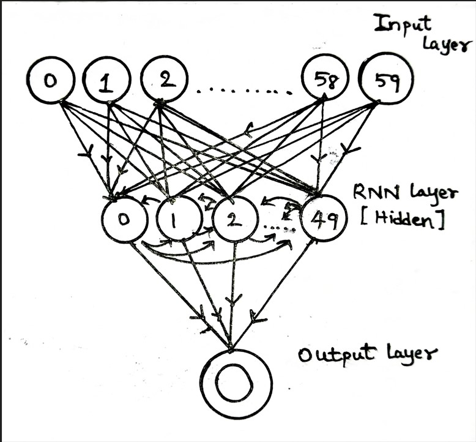

# EXP-4: Stock Price Prediction
## AIM:

### To develop a Recurrent Neural Network model for stock price prediction.

## Problem Statement and Dataset:

* The given problem is to predict the google stock price based on time.
* For this we are provided with a dataset which contains features like
* Date, Opening Price, Highest Price, Lowest Price, Closing Price, Adjusted Closing Price, Volume
* Based on the given features, develop a RNN model to predict, the price of stocks in future

## Neural Network Model




## DESIGN STEPS

### STEP 1: Read the csv file and create the Data frame using pandas.
### STEP 2: Select the " Open " column for prediction. Or select any column of your interest and scale the values using MinMaxScaler.
### STEP 3: Create two lists for X_train and y_train. And append the collection of 60 readings in X_train, for which the 61st reading will be the first output in y_train.
### STEP 4: Create a model with the desired number of neurons and one output neuron.
### STEP 5: Follow the same steps to create the Test data. But make sure you combine the training data with the test data.
### STEP 6: Make Predictions and plot the graph with the Actual and Predicted values.

## PROGRAM
```
Developed By : Kadin Samson L
Reg No : 212221230044
```
```py
import numpy as np
import matplotlib.pyplot as plt
import pandas as pd
from sklearn.preprocessing import MinMaxScaler
from keras import layers
from keras.models import Sequential

### Read Train Data & Normalize:

dataset_train = pd.read_csv('trainset.csv')

dataset_train.columns

dataset_train.head()

train_set = dataset_train.iloc[:,1:2].values

type(train_set)

train_set.shape

sc = MinMaxScaler(feature_range=(0,1))
training_set_scaled = sc.fit_transform(train_set)

training_set_scaled.shape

X_train_array = []
y_train_array = []
for i in range(60, 1259):
  X_train_array.append(training_set_scaled[i-60:i,0])
  y_train_array.append(training_set_scaled[i,0])
X_train, y_train = np.array(X_train_array), np.array(y_train_array)
X_train1 = X_train.reshape((X_train.shape[0], X_train.shape[1],1))

X_train.shape

length = 60
n_features = 1

### Build & Train Model:

model = Sequential([layers.SimpleRNN(50,input_shape=(60,1)),
                    layers.Dense(1)])

model.compile(optimizer='adam',loss='mse')
model.summary()

model.fit(X_train1,y_train,epochs=20, batch_size=32)

### Read Test Data & Normalize:

dataset_test = pd.read_csv('testset.csv')

test_set = dataset_test.iloc[:,1:2].values

test_set.shape

dataset_total = pd.concat((dataset_train['Open'],dataset_test['Open']),axis=0)

inputs = dataset_total.values
inputs = inputs.reshape(-1,1)
inputs_scaled=sc.transform(inputs)
X_test = []
y_test = []
for i in range(60,1384):
  X_test.append(inputs_scaled[i-60:i,0])
  y_test.append(inputs_scaled[i,0])
X_test = np.array(X_test)
X_test = np.reshape(X_test,(X_test.shape[0], X_test.shape[1],1))

X_test.shape


### Predict Values & Plot:

predicted_stock_price_scaled = model.predict(X_test)
predicted_stock_price = sc.inverse_transform(predicted_stock_price_scaled)

plt.plot(np.arange(0,1384),inputs, color='red', label = 'Test(Real) Google stock price')
plt.plot(np.arange(60,1384),predicted_stock_price, color='blue', 
		label = 'Predicted Google stock price')
plt.title('Google Stock Price Prediction')
plt.xlabel('Time')
plt.ylabel('Google Stock Price')
plt.legend()
plt.show()


### Check MSE Score:

from sklearn.metrics import mean_squared_error as mse
mse(y_test,predicted_stock_price)
```

## OUTPUT:

### True Stock Price, Predicted Stock Price vs time:


### Mean Square Error:


## RESULT:

Thus, a Recurrent Neural Network model for stock price prediction is developed.
